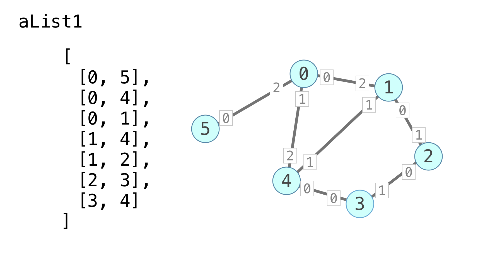
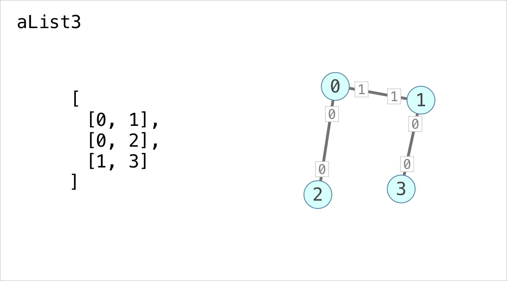
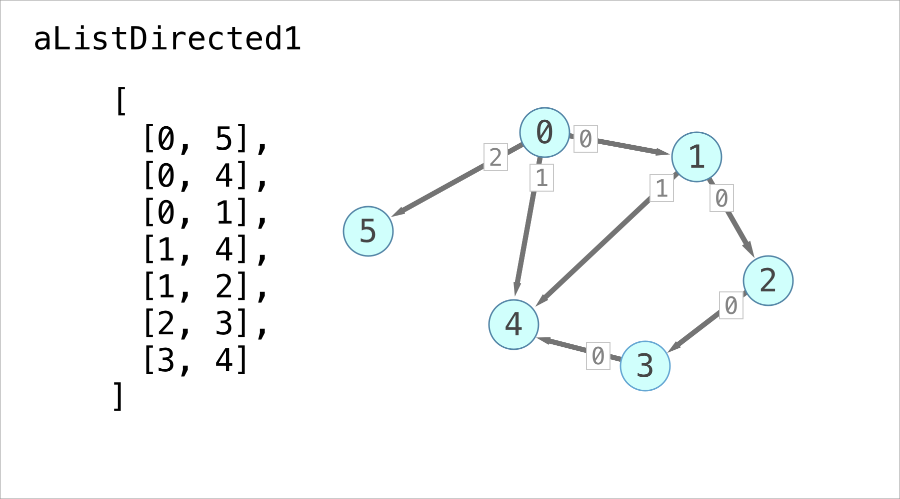
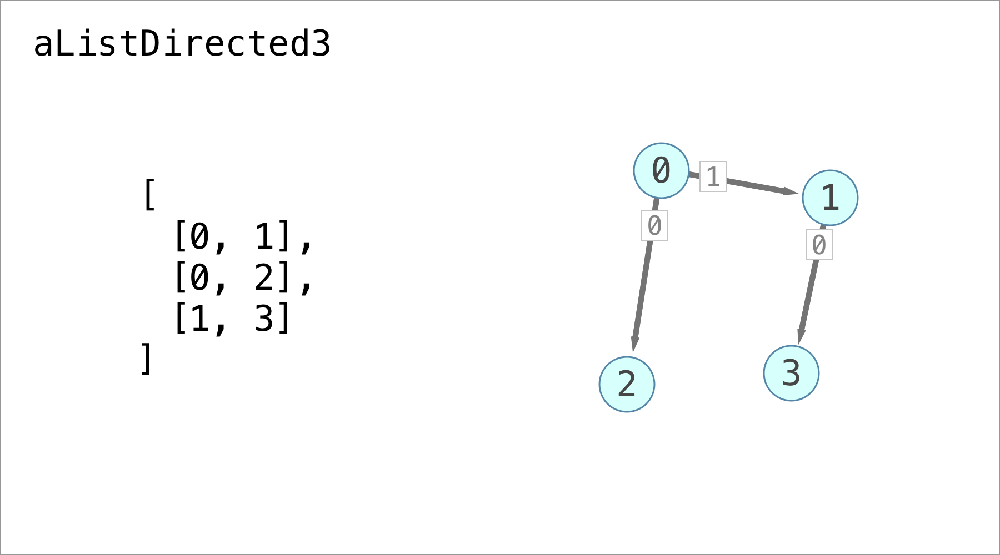

title: Adjacency Lists in Javascript
description: A Javascript Implementation of Adjacency List methods from the Algorithm Design Manual
link: /adjacency-lists-in-javascript
~---~
# Ajacency Lists in Javascript

I have been reading through the [Algorithm Design Manual](http://www.algorist.com/). In order to get a deeper understanding of the graph algorithms in Chapter 5, I decided to reimplement them in Javascript. Checkout the github repo [here](https://github.com/zindlerb/javascript_adjacency_list).

All the algorithms in Chapter 5 center around a data structure called the Adjacency List. An Adjacency List stores a graph in an array of linked lists. Every index in the array corresponds to a vertex on the graph and every node in the linked list corresponds to an edge. The algorithms are hard to understand without examples so here are some illustrated examples of the different inputs for the test cases:











The numbered white squares correspond to the ordering of the edges. And here is another test input from figure 5.12:


The green numbers are entry times and the red numbers are exit times.

The Adjacency List implementation is mostly faithful to the book but some simplifications have been made. For example because this is not C I don't initialize the arrays with values.

You can find the implementation [here](https://github.com/zindlerb/javascript_adjacency_list/blob/master/adjacency_list.js) and the tests [here](https://github.com/zindlerb/javascript_adjacency_list/blob/master/__tests__/adjacency_list.js). Run the tests by following these steps in your terminal:

``` shell
git clone https://github.com/zindlerb/javascript_adjacency_list
cd javascript_adjacency_list
npm install
npm run test
```
